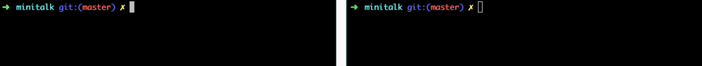

``` console
                        ..            ..  dP            dP  dP
                                         888P           88  88
          88d88bd88.    dP  88d88b.   dP  88  .d8888b.  88  88  .dP
          88' `88' `88  88  88'  `88  88  88  88'  `88  88  88888"
          88   88   88  88  88    88  88  88  88.  .88  88  88  `8b.
          dP   8P   8P  dP  dP    8P  dP  dP  `88888P8  dP  dP   `YP
```

# Minitalk

42 School project Minitalk: a small data exchange program using
UNIX signals.
Norminette codestyle. 

[**subject.pdf**](en.subject.pdf)

## Cloning
```
git clone https://github.com/AchioteTory/Minitalk.git
```
## Run
```
make
```


## Bonus part
small reception acknowledgment system is added
```
make bonus
```

